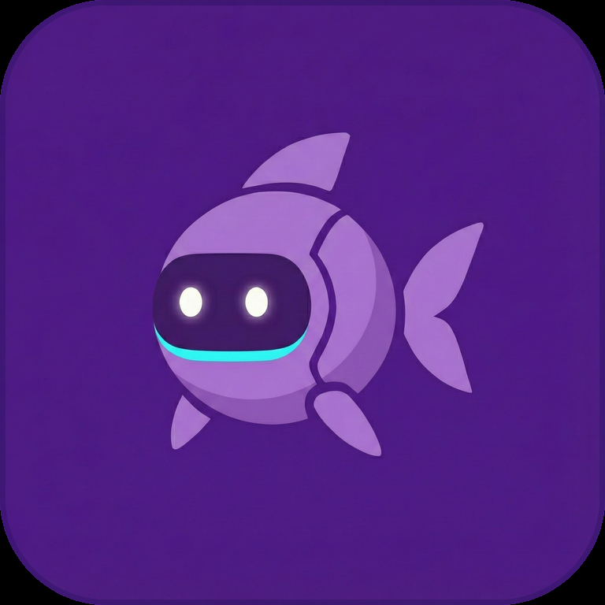
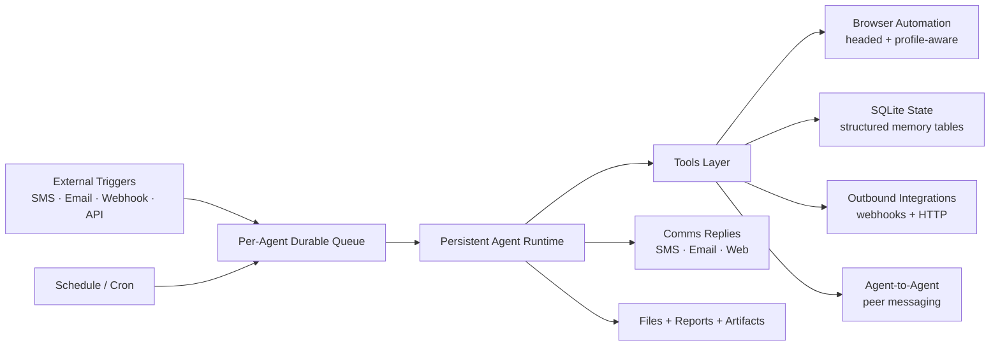
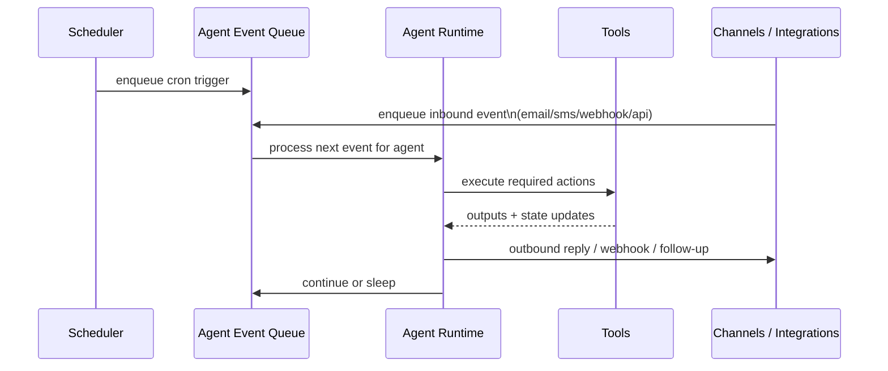

<p align="center">
  <picture>
    <source media="(prefers-color-scheme: dark)" srcset="assets/logo/gobii-fish-readme-dark.png" />
    <source media="(prefers-color-scheme: light)" srcset="assets/logo/gobii-fish-readme-light.png" />
    
  </picture>
</p>

<h1 align="center">Gobii Platform</h1>

<p align="center">
  <strong>Always-on AI employees for teams.</strong><br/>
  Built on <a href="https://github.com/browser-use/browser-use">browser-use</a>. Designed for secure, cloud-native operations.
</p>

<p align="center">
  
  
  
</p>

<p align="center">
  <a href="https://gobii.ai">Website</a>
  ·
  <a href="https://docs.gobii.ai/">Docs</a>
  ·
  <a href="https://discord.gg/yyDB8GwxtE">Discord</a>
  ·
  <a href="https://gobii.ai/pricing">Cloud</a>
</p>

Gobii is the open-source platform for running durable autonomous agents in production.
Each agent can run continuously, wake from schedules and events, use real browsers, call external systems, and coordinate with other agents.

If you are optimizing for local-first personal assistant UX on a single device, there are excellent projects for that.
Gobii is optimized for a different problem: reliable, secure, always-on agent operations for teams and businesses.

<div style="width: 100%; text-align: center">
  <video
    src="https://github.com/user-attachments/assets/b18068c6-695c-4a21-ac08-c298218b7882"
    width="900"
    controls
    muted
    loop
    playsinline
    poster="https://github.com/user-attachments/assets/ab12cd34-ef56-7890-gh12-ijkl3456mnop"
    style="border-radius:12px;box-shadow:0 4px 12px rgba(0,0,0,0.15);max-width:100%;height:auto;"
  >
  </video>
  <br/>
  <em>Gobii agent demo in action</em>
</div>

## Table of Contents

- [Why Teams Choose Gobii](#why-teams-choose-gobii)
- [How Gobii Works](#how-gobii-works)
- [Always-On Runtime: Schedule + Event Triggers](#always-on-runtime-schedule--event-triggers)
- [Production Browser Runtime](#production-browser-runtime)
- [Identity, Channels, and Agent-to-Agent](#identity-channels-and-agent-to-agent)
- [Security Posture](#security-posture)
- [Launch in 5 Minutes](#launch-in-5-minutes)
- [API Quick Start](#api-quick-start)
- [Deployment Paths](#deployment-paths)
- [Operational Profiles](#operational-profiles)
- [Production Use Cases](#production-use-cases)
- [FAQ](#faq)
- [Developer Workflow](#developer-workflow)
- [Docs and Deep Dives](#docs-and-deep-dives)
- [Contributing](#contributing)
- [License and Trademarks](#license-and-trademarks)

## Why Teams Choose Gobii

- **Always-on by default**: per-agent schedule state plus durable event processing.
- **Identity-bearing agents**: endpoint-addressable agents across email, SMS, and web channels.
- **Native agent-to-agent messaging**: linked agents can coordinate directly.
- **Webhook-native integration model**: inbound webhooks wake agents; outbound webhooks are first-class agent actions.
- **Based on browser-use**: keeps `/api/v1/tasks/browser-use/` compatibility while adding platform-level runtime controls.
- **SQLite-native operational memory**: structured state substrate for long-running tool workflows.
- **Real browser operations**: headed execution, persistent profile handling, and proxy-aware routing.
- **Security-first controls**: encrypted-at-rest secrets, proxy-governed egress, and Kubernetes sandbox compute support.

## How Gobii Works



### Gobii Focus vs Typical Personal Assistant Stacks

| Area | Gobii focus |
| --- | --- |
| Runtime model | Long-lived schedule + event lifecycle |
| Primary operator | Teams and organizations |
| Agent identity | Addressable communication endpoints |
| Orchestration | Always-on processing + native A2A |
| Browser workload shape | Production tasks with persisted state |
| Security posture | Controlled egress, encrypted secrets, sandbox compute |

## Always-On Runtime: Schedule + Event Triggers

Gobii agents are built to stay active over time, not just respond in isolated turns.



This gives you continuity for real workflows: queued work, retries, deferred actions, and predictable wake/sleep behavior.

## Production Browser Runtime

Gobii is based on browser-use and adds production runtime behavior around it.

- **Headed browser support** for realistic web workflows.
- **Persistent browser profile handling** for long-running agents.
- **Proxy-aware browser and HTTP task routing** for controlled egress paths.
- **Task-level API compatibility** via `/api/v1/tasks/browser-use/`.

## Identity, Channels, and Agent-to-Agent

Gobii treats agents as operational entities, not just prompt sessions.

- Agents can own communication endpoints (email, SMS, web).
- Managed deployments support first-party agent identities like `first.last@my.gobii.ai`.
- Inbound email/SMS/web events can wake agents and route into the same runtime lifecycle.
- Agents can directly message linked peer agents for native coordination.

## Security Posture

Gobii's architecture is built for production guardrails.

- **Encrypted secrets** integrated into agent tooling.
- **Proxy-governed outbound access** with health-aware selection and dedicated proxy inventory support.
- **Sandboxed compute support** for isolated tool execution.
- **Kubernetes backend support** with gVisor runtime-class integration in sandbox compute paths.

For sandbox compute design references:

- [Sandbox compute spec](docs/design/sandbox_pods_compute_spec.md)
- [Sandbox compute ops notes](docs/design/sandbox-compute-ops.md)

## Launch in 5 Minutes

1. **Prerequisites**: Docker Desktop (or compatible engine) with at least 12 GB RAM allocated.
2. **Clone the repo**.

```bash
git clone https://github.com/gobii-ai/gobii-platform.git
cd gobii-platform
```

3. **Start Gobii**.

```bash
docker compose up --build
```

4. **Open Gobii** at [http://localhost:8000](http://localhost:8000) and complete setup.

- Create your admin account.
- Choose model providers (OpenAI, OpenRouter, Anthropic, Fireworks, or custom endpoint).
- Add API keys and preferred model configuration.

5. **Create your first always-on agent**.

Optional runtime profiles:

- `docker compose --profile beat up` for scheduled trigger processing.
- `docker compose --profile email up` for IMAP idlers and inbound email workflows.
- `docker compose --profile obs up` for Flower + OTEL collector observability services.

## API Quick Start

```bash
curl --no-buffer \
  -H "X-Api-Key: $GOBII_API_KEY" \
  -H "Content-Type: application/json" \
  -X POST http://localhost:8000/api/v1/tasks/browser-use/ \
  -d '{
        "prompt": "Visit https://news.ycombinator.com and return the top headline",
        "wait": 60,
        "output_schema": {
          "type": "object",
          "properties": {
            "headline": {"type": "string"}
          },
          "required": ["headline"],
          "additionalProperties": false
        }
      }'
```

## Deployment Paths

| Self-host (this repo) | Gobii Cloud (managed) |
| --- | --- |
| MIT-licensed core on your own infrastructure | Managed Gobii deployment and operations |
| Full runtime/networking/integration control | Governed releases and managed scaling |
| Best for source-level customization | Best for faster production rollout |

## Operational Profiles

Gobii keeps the default boot path simple, then lets you add worker roles as needed.

| Profile | Command | What it adds |
| --- | --- | --- |
| Core | `docker compose up --build` | App server + worker + Redis + Postgres + migrations/bootstrap |
| Scheduler | `docker compose --profile beat up` | Celery beat + schedule sync for cron/event timing |
| Email listeners | `docker compose --profile email up` | IMAP idlers for inbound email automation |
| Observability | `docker compose --profile obs up` | Flower + OTEL collector services |

## Production Use Cases

- **Revenue ops agents**: monitor inboxes and web systems continuously, update records, and send structured summaries.
- **Recruiting ops agents**: source candidates, enrich profiles, and coordinate outbound messaging from persistent workflows.
- **Support and success agents**: triage inbound channels, execute browser-backed actions, and escalate with full state continuity.
- **Back-office automation**: run long-lived, trigger-driven workflows that need durable memory and secure credentials handling.

## FAQ

### Is Gobii just a UI around browser-use?

No. Gobii is based on browser-use, but adds persistent agent runtime behavior: schedule/event lifecycle, comms channels, webhooks, memory, orchestration, and operational controls.

### Is Gobii built for personal assistant usage?

Gobii can power individual workflows, but the architecture is tuned for team and business operations where agents stay active and integrate into production systems.

### Does Gobii support headed browsers?

Yes. Gobii supports headed browser workflows and persistent profile handling for realistic web task execution.

### What does “always-on” mean here?

Agents can wake from schedules and external events (email/SMS/webhooks/API), process durable queued work, and continue across turns instead of resetting every interaction.

### What is the security model?

Gobii integrates encrypted-at-rest secrets, proxy-aware outbound controls, and sandbox compute support with Kubernetes/gVisor backend options for stronger isolation.

## Developer Workflow

Use [DEVELOPMENT.md](DEVELOPMENT.md) for the complete local setup and iteration flow.

Typical loop:

```bash
# backing services
docker compose -f docker-compose.dev.yaml up

# app server
uv run uvicorn config.asgi:application --reload --host 0.0.0.0 --port 8000

# workers (macOS-safe config)
uv run celery -A config worker -l info --pool=threads --concurrency=4
```

## Docs and Deep Dives

- Getting started: [Introduction](https://docs.gobii.ai/getting-started/introduction)
- Developer foundations: [Developer Basics](https://docs.gobii.ai/developers/developer-basics)
- Agent API: [Agents](https://docs.gobii.ai/developers/developer-agents)
- Browser task execution: [Tasks](https://docs.gobii.ai/developers/developer-tasks)
- Structured outputs: [Structured Data](https://docs.gobii.ai/developers/structured-data)
- Event ingress and automation: [Webhooks](https://docs.gobii.ai/developers/webhooks)
- REST reference: [API Reference](https://docs.gobii.ai/api-reference)
- Self-hosting: [Self-Hosted Deployment Overview](https://docs.gobii.ai/self-hosted/overview)
- Concepts: [Agents](https://docs.gobii.ai/core-concepts/agents), [Dedicated IPs](https://docs.gobii.ai/core-concepts/dedicated-ips)
- Advanced integrations: [MCP Servers](https://docs.gobii.ai/advanced-usage/mcp-servers)
- Local sandbox design docs: [docs/design](docs/design)

## Contributing

- Open issues and PRs are welcome.
- Follow existing project style and test conventions.
- Join the community on [Discord](https://discord.gg/yyDB8GwxtE).

## License and Trademarks

- Source code is licensed under [MIT](LICENSE).
- Gobii name and logo are trademarks of Gobii, Inc. See [NOTICE](NOTICE).
- Proprietary mode and non-MIT components require a commercial agreement with Gobii, Inc.
